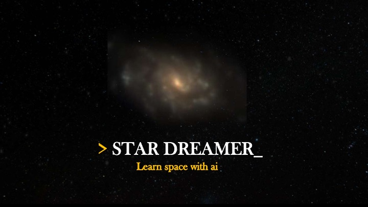
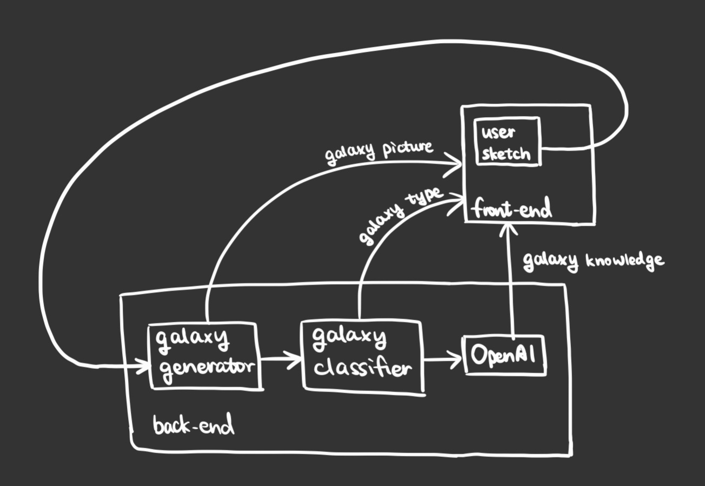

# Star Dreamer

#

## Inspiration
Not everyone can draw stars as good as Van Gogh, or having access to telescopes like Galileo, but using web technologies, we can allow everyone to create their own universe, as if they are an artist, while learning something new about the space. We also want to make space knowledge more accessible to us on earth - people don't need to go to an observatory to learn more about the space. You can do so anywhere anytime with a mobile device, thus bring the stars within reach for us humans.

## What it does
It's called star dreamer, which provides a fun & unique way for people to explore the universe & learn more about different types of galaxies through drawing pictures.
Here's how it works:
- first, user can create drawings on the webpage using their mouse
- next, a galaxy image will be generated by an AI powered galaxy generator (trained on 360k galaxy images, can generate galaxy picture based on your hand sketch)
- when you click on this image, you’ll see some scientific knowledge about this type of galaxy being displayed 

## How we built it
Front end gets user sketch & send to the backend, which is fed into an galaxy generator to generate a galaxy picture, and then that picture is fed into a galaxy classifier to determine which type of galaxy it belongs to, after that, we leveraged openai’s powerful GPT-3 api to obtain properties of this type of galaxy.

## Challenges we ran into
Unpredictable behavior and flawed generated image from generative machine learning models.
The time consumption and over complexity of simulation based on PVH algorithms (which casued the change from galaxy formation simulation in real time to the used of latent diffusion models)

## Accomplishments that we're proud of
This website we built not only can inspire people to explore the universe in a fun & interactive manner, but also provides a unique way for people to express their artistic side while learning space-related scientific knowledge. 
Construted a pipeline for processing diffusion models in multi threaded manner and efficient CUDA resource allocation as a method of generating galaxies from given giggles

## What we learned
1. The optimization and tunning of latent diffusion models
2. Methods to construct web service based on high-performance GPU computation

## What's next for Star Dreamer
1: Further tune the models with better dataset and configurations
2: Create the real time 3 dimensional interactive galaxy physics (PVH) simulation derived from generated images (with a specifically designed ml model)
3: Deploy the project to paralleled GPU servers for improvement in performance, too slow now. 
4: Train the semantic networks to create stronger relations from given prompt (drawings) to generated galaxy images.

## Architecture

#

## How to deploy

1. First, clone the project to your computer.
2. Run the main function in main.py as the server.
3. download the weights file "probes_model_00745000.pt
" from https://zenodo.org/record/5653517 and put it in the weights directory
3. Open index.html and then you can try it!